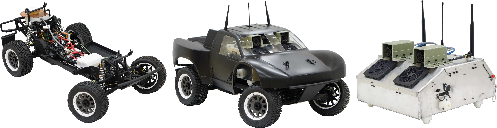

[note]: https://github.com/AutoRally/autorally/wiki/note_icon.png "note"

# AutoRally Platform Instructions

The documents contained in this repository provide all of the information required to contruct and operate a complete AutoRally platform. The platform has two primary parts, the chassis and compute box.

![alt text][note] Please contact us by opening and issue or emailing if you have any questions about the instructions, parts, or any part of the build process.

## Getting Started

Look though the documentation and [Download](https://github.com/AutoRally/autorally_platform_instructions/releases) our latest release. Look over the Getting Started section in the chassis and compute box instruction documents, followed by the parts list and the operating procedures to get a sense of the build process, skill requirements, fabriation methods, and testing procedures. The AutoRally platform can be fabricated by a small team (2-3 students) of non-professionals. The build will go most smoothly if there is at least one person on the team familiar with basic soldering, 3D printing, Ubuntu and ROS configuration. We also link to tutorials for all of the skills required, so any interested party can easily acquire them.

![alt text][note]  The most difficult component to fabricate is the compute box enclosure, which may require sending away to a local sheet metal fabrication shop if sheet metal fabrication experience and tools are not available.

Before testing a platform you build, make sure to complete the [Setup Instructions](https://github.com/AutoRally/autorally) and the [Platform Configuration Instructions](https://github.com/AutoRally/autorally/wiki/Platform%20Configuration%20Instructions).

## Included Files:

### autoRally_chassis_instructions

Complete instructions to build an AutoRally chassis.

### autoRally_compute_box_instructions

Complete instructions to build a Mini-ITX AutoRally compute box.

### autoRally_operating_procedures

Document outlining pre-run preparations, starting up and operating the platform, and post-run procedures.

### autoRally_platform_parts_list

Spreadsheet of all parts required to build an AutoRally Platform. The document includes the estimated price, quantities, and link to purchase each component. Parts are organized by vendor, and color coded by where on the platform they are used. The list includes the required parts, parts that help with usability (spare set of batteries), and some common maintenance items.

![alt text][note]  The platform uses parts from about 25 suppliers.

![alt text][note]  Review the entire list before making any purchases as you may already have some of the parts around such as computer monitors, spare laptops for use as ground station, assorted cables, keyboard and mouse, tools, and supplies. 

### diagrams/

Wiring diagrams for the custom AutoRally chassis and compute box assemblies.

### manuals/

Product manuals for individual parts involved in the build.

### models/

CAD models for components to be fabricated (most will be 3D printed).
